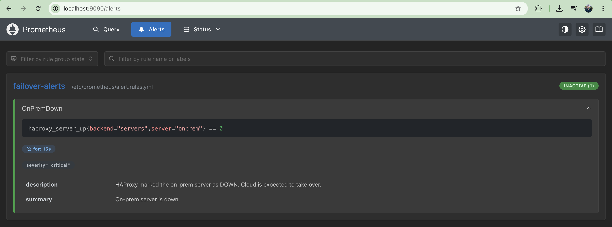
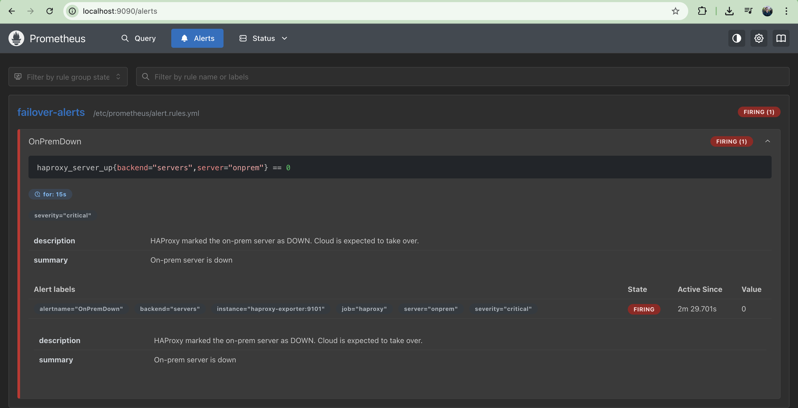
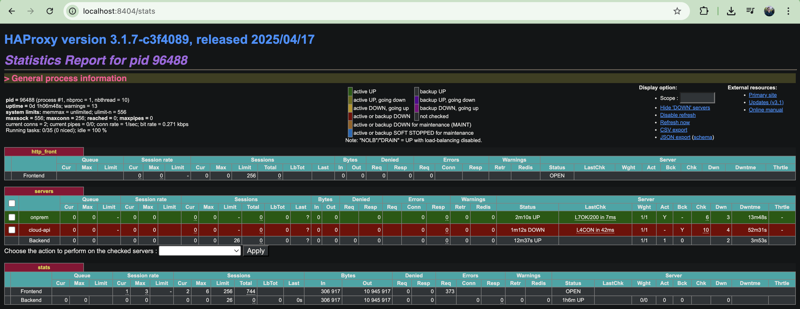
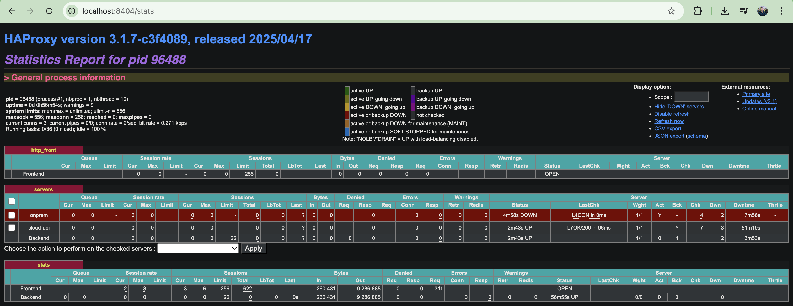
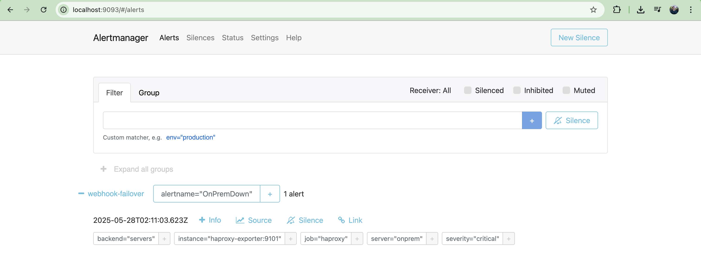
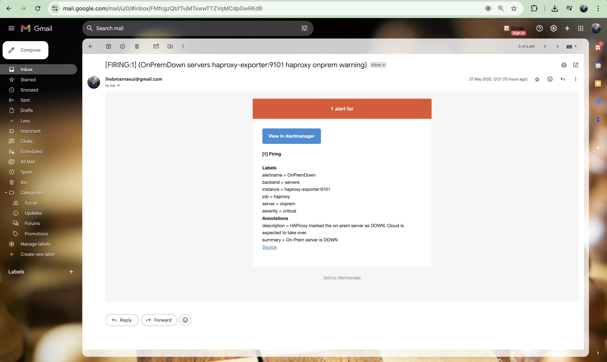

# ⚙️ Infrastructure Design & Resilience Automation

This project showcases a **self-healing hybrid infrastructure** with automatic **failover detection, traffic redirection**, and **cloud-based recovery** — built using modern DevOps tools and principles. The system is built with:

- 🐳 Docker for service containers  
- 🧪 Prometheus + Alertmanager for monitoring & alerting  
- 🌐 HAProxy for load balancing & failover detection  
- ☁️ Terraform for provisioning cloud infrastructure  
- 🔁 GitHub Actions for lifecycle management and CI/CD  
- 🧵 Python Flask for the webhook automation service  

---

## 🛠️ Getting Started

### 1. Clone the Repository

```bash
git clone https://github.com/ihebmarnaoui/Infrastructure-Design-Resilience-Automation.git
cd Infrastructure-Design-Resilience-Automation
```

### 2. Build the On-Prem Docker Image

> A helper script `scripts/build_onprem.sh` is provided to build and run the on-prem service locally.

```bash
> 📁 [scripts/build_onprem.sh](scripts/build_onprem.sh)
```

This will:
- Build the `onprem-api` Docker image
- Run it on port `5000` to simulate an on-premise deployment

---

## 🧠 What This Project Does

This project implements a **hybrid, self-healing infrastructure** that automatically fails over to the cloud when the local (on-prem) service goes down. Here's a breakdown of how the components work together in depth:

### 🔍 Real-Time Health Monitoring (Prometheus + Alertmanager)

- A **Prometheus** server constantly scrapes the endpoint of the on-prem API (`http://localhost:5000/`).
- If the API becomes unreachable or returns non-2xx responses, Prometheus **triggers a custom alert**.
- These alerts are configured in **Prometheus rules** and forwarded to **Alertmanager**.

### 📣 Webhook-Driven Automation (Alertmanager → Flask Webhook on EC2)

- **Alertmanager** is configured with a **webhook receiver** that POSTs JSON payloads to a lightweight **Flask application** running on the cloud EC2 instance.
- The Flask app is exposed via `/failover` and handles incoming alerts.
- Based on the alert type (`onprem_down` or `onprem_recovered`), the webhook triggers scripts that **start or stop** the Docker container running the cloud API.

### ⚙️ Cloud Failover Service (Docker on EC2)

- The EC2 instance runs a Docker-based clone of the on-prem API.
- When the webhook is triggered, the EC2 instance **automatically spins up or shuts down** the cloud API container depending on the current system state.
- This provides **automated failover** and **automatic recovery** without manual intervention.

### 📡 Traffic Routing and Load Balancing (HAProxy)

- An **HAProxy** instance runs on the on-prem system to route requests:
  - If the on-prem API is up, it forwards traffic locally.
  - If not, it automatically falls back to the cloud EC2 API using health checks.
- HAProxy ensures **zero manual change** in endpoint for clients — they always hit the same address, but the backend changes transparently.

### ☁️ Infrastructure as Code (Terraform)

- **Terraform** automates provisioning of the EC2 instance, security groups, SSH access, and user data scripts.
- Upon deployment, the EC2 instance **self-configures**:
  - Installs Docker and Python
  - Clones this repository
  - Builds the Docker image
  - Starts the Flask failover webhook as a `systemd` service

### 🔁 Lifecycle Bootstrapping (GitHub Actions)

- A minimal **GitHub Actions workflow** is provided to **bootstrap the infrastructure**:
  - It uses Terraform to provision the EC2 instance with the correct setup and user data.
---

Together, these components form a **complete, production-ready blueprint** for building self-healing, hybrid cloud systems that automatically adapt to runtime failures without human intervention.

> 🧩 This project doesn't just monitor and alert — it **reacts and recovers automatically** using a real cloud deployment.

---

## 📷 Observability

- ✅ Prometheus alert screenshots  



- ✅ HAProxy dashboard  



- ✅ Alertmanager config
  

- ✅ email triggers

---

## 🧪 Lifecycle Testing

Use the following scripts to simulate failure and recovery:

```bash
bash scripts/simulate_onprem_down.sh
bash scripts/simulate_onprem_up.sh
```

These scripts stop/start the on-prem container to simulate outages and recoveries.

---

## 🧱 Infrastructure Overview

- EC2 runs the webhook receiver and Docker service
- Prometheus and Alertmanager run locally with HAProxy
- Terraform handles all provisioning
- GitHub Actions can be used to orchestrate setup

---

## 🚀 Future Work

- [ ] Include Grafana dashboards for visualization
- [ ] Add unit tests and health coverage reports
- [ ] Build a CLI for end-to-end testing

---

## 📝 Author

**Iheb Marnaoui**  
Cloud & DevOps Engineer  
GitHub: [@ihebmarnaoui](https://github.com/ihebmarnaoui)

